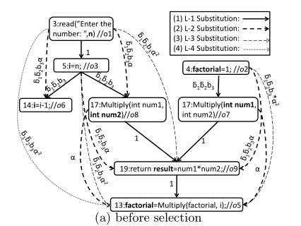

# 预言数据选择工具SODS复现

[Supporting Oracle Construction Via Static Analysis](https://github.com/linzs148/MYSODS/blob/main/resources/%5BASE'16%5DSupporting_oracle_construction_via_static_analysis.pdf)

**（由于论文没有提供源码，WALA的使用也没什么教程，更没有系统性学过程序分析，所以复现的程度十分有限，希望助教能够多给点分呜呜呜）**

## 论文理解

### 测试预言

用于**确定程序对于给定的测试输入能否正常运行的预期输出**，由测试期间要观察的变量及其预期值组成。由于程序通常由各种内部变量和输出变量组成，在软件测试的不同位置都可以观察到这些变量，因此程序有许多候选预言数据可以包含在测试预言中。

选择**正确的预言数据**是构建测试预言的关键，选择**高质量的预言数据**对于检测软件故障的效果和效率至关重要。

针对测试预言存在以下两大问题：

尽管研究人员提出了各种技术来自动生成测试输入，但测试预言问题仍然被认为是软件测试中最困难的问题之一，换而言之，我们有各种方法生成测试输入，但是**很难获得这些输入的预期输出**；

测试预言包含的预言数据越多，其检测故障的能力就越强，然而使用全部或大部分预言数据构建测测试预言的**成本可能非常**高。因此出现了预言数据选择算法，目的是**构建测试预言时在保证测试效果的前提下减少使用到的预言数据的数量**。


### 预言数据

在变量涉及**赋值、函数传参、函数返回值**的时候定义对应的候选预言数据。

为了减少候选预言数据的数量，只考虑变量**第一次**赋值的时候定义对应的候选预言数据。

如果选定的预言数据**不稳定**（例如在同一测试输入的不同执行期间可能产生不同值的随机变量）我们将其从选定的预言数据集中删除。

从宏观的角度看，软件故障是由开发人员在编程中编写的错误代码引起的。从微观角度看，错误在执行过程中由变量的值反映出来，通过观察预言数据的值可能会检测到错误语句导致的故障。


示例

```C++
void factorial() {
    int n, factorial, i;
    read("Enter the number:", n);//o1
    factorial = 1;//o2
    i = n;//o3
    if (n < 0) print("wrong input is:", n);
    else {
    	if (n == 0) factorial = 0;//o4
        else {
            while (i > 0) {
                factorial = multiply(factorial, i);//o5
                i = i−1;//o6
            }
            print("The result is:", factorial);
        }

int multiply(int num1, int num2) {//o7, o8
    int result;
	return result = num1 ∗ num2;//o9
}
```


### 预言数据选择技术

* 使用所有候选预言数据构建测试预言的成本很高，因此有必要确定这些候选预言数据的选择顺序，以便开发人员可以使用少量预言数据构建高质量的测试预言。
* 在构建测试预言时，具有较大故障观察能力的候选预言数据往往会提前选择。
* 仅根据预言数据的故障检测能力排序来选择预言数据可能不太有效，因为某些候选预言数据会观察由相同语句导致的故障。

预言数据选择的目标应该是**最大化选定预言数据集的故障观察能力**，而不是最大化每个选定预言数据单独的故障观察能力。


### 动态预言数据选择

通过分析测试执行期间信息（变量值、交互信息等）进行预言数据的选择。包括以下两种：

* MAODS，主要针对大量突变体运行测试输入，并根据这些变量区别于原始程序的突变体数量选择预言数据。
* DODONA，仅针对面向对象的程序，通过分析执行过程中变量关系图的网络中心度来选择预言数据。

不足之处在于程序执行期间收集测试执行信息会产生额外的时间和费用成本。


### 静态预言数据选择

SODS(Static Oracle Data Selection)

通过基于被测程序的定义使用链来构建概率替换图以识别候选预言数据之间的替换关系，然后估计每个候选预言数据的故障观察能力，最后选择具有较强故障观察能力的预言数据子集。


##### Basic SODS

1. 通过基于被测程序的定义使用链来构建概率替换图，概率替换图是一个表示候选预言数据在多大程度上可以替代其他数据的图；
2. 通过考虑替换关系的转移程度（以$α$度量）来估计每个候选预言数据在观察每个语句中的错误方面的能力；
3. 根据故障观察能力和选定预言数据的影响（通过$f_p$度量）确定候选预言数据的选择顺序。


##### Extended SODS

1. Basic SODS；
2. 只关注程序中被测试的部分，基于0-1-CFA测试调用图分析来裁剪被测程序并剪枝概率替换图，以提高预言数据选择的有效性。


#### 概率替换图的构建

##### 定义使用链

两个预言数据$o_i$和$o_j$组成的结构，以确保**变量$o_i$的定义使用$o_j$定义的变量的值**而无需其他预言数据干预。符号表示为$o_i <= o_j$

例如，$o_3$和$o_1$构成一个定义使用链，观察$o_3$可以检测到$o_1$的值错误导致的故障，因此在软件测试中$o_3$可以作为$o_1$的替代品。

基于定义使用链，我们可以在候选预言数据之间构建替换关系。

注意定义使用链具有**传递性**。


#### 预言数据权重的生成

* 所有循环将被视为有一次迭代，$while (i > 0) => if (i > 0)$
* $o_i$和$o_j定义的语句总是一起执行 => $P(o_i > o_j) = 1$
* 对$if$语句应用乘法原理，例如$P(o_6 > o_3) = \overline{b_1} * \overline{b_2} * b_3$， $b_1$、$b_2$和$b_3$分别表示$n < 0$、$n == 0$和$i > 0$的概率


#### 预言数据的选择算法

$W(o_i)$: 遍历概率替换图以查找通过$o_i$可以检测到故障的所有预言数据集合（包括$o_i$本身）。

$FOC(i, j)$: $o_i$检测$o_j$导致的故障的能力大小。

$α$: 表示长度大于1的路径中替换关系传递的程度。


##### FOC计算

* $FOC(i, i) = 1$
* $o_i <= o_j => FOC(i, j) = P(o_i > o_j)$
* $FOC(path) = α ^ {s - 1} * P(o_i, o_{k1}) * ... * P(o_{ks - 1}, o_{ks})$, $α$用于测量替代关系的程度
* $FOC(i, j) = \sum^l_{t = 1}{path_t}$
* $FOC(i) = \sum^{}_{o_j \in W(o_i)}{FOC(i, j)}$




##### 算法流程

(考虑重复覆盖造成的影响，类似于增量贪心算法)


伪代码

```pseudocode
// Algorithm 1 预言 data selection
// 初始状态下所有已选预言数据集为空，所有预言数据的FOC均为0
for each i (1 <= i <= n) do
	Selected[i] = false
	FOC[i] = 0
	// fp[i] = 0
end for

// 计算所有预言数据的FOC值
for each i (1 <= i <= n) do
	for each j (1 <= j <= n) do
		if FOC[i, j] > 0 then
			FOC[i] = FOC[i] + FOC[i, j]
		end if
	end for
end for

// 选出故障检测能力最大的m个预言数据集
for each j (1 <= j <= m) do
	current = 0
	k = 0
	// 挑选出未被选择数据中FOC值最大的预言数据k
	for each i (1 <= i <= n) do
		if not Selected[i] then
			if FOC[i] > current then
				current = FOC[i]
				k = i
			end if
		end if
	end for
	Selected[k] = true
	FOC[k] = 0
	// 对于数据k所能检测到故障的数据W(o_k)，消除W(o_k)对于其他数据FOC值的影响
	// fp测量选定预言数据对未选定预言数据的影响
	for each i (1 <= i <= n) do
		if FOC[k, i] > 0 then
			// fp[i] = fp[i] + FOC[k, i]
			// fp = fp[i]
            for each s (1 <= s <= n) do
                if k != s ^ FOC[s, i] > 0 ^ not Selected[s] then
                    FOC[s] = FOC[s] - FOC[s, i] * fp
                    FOC[s, i] = FOC[s, i] - FOC[s, i] * fp
                end if
            end for
        end if
    end for
end for
```


##### $f_p$的选择

我们使用$f_p$测量选定预言数据对未选定预言数据的影响。

* 常量

  由于选择$o_k$有助于观察所有$FOC[k，i] ＞ 0$的语句$i$中的错误，所以不需要再去观察这些语句，将$f_p$的值设置为1。

* 变量

  考虑到选定的预言数据对不同的未选定预言数据有不同的影响，为不同的预言数据提供了不同的$f_p$值。我们使用数组$fp[i] (i <= i <= n)$表示$o_i$的$f_p$值，初始状态下所有预言数据的$p_f$值均为0。一旦选择了$o_k$，对于$FOC[k, i] > 0$的那些语句i我们更新$f_p[i] = f_p[i] + FOC[k, i]$，这意味着选择了$o_k$会增加对未选定预言数据的故障观察能力的影响。对于$o_i$，选择到的能够检测到$o_i$错误的语句越多，$f_p[i]$的值也就相应越大，$FOC[s，i]$的值就越小，换句话说，我们通过增加$o_i$的$f_p$值使得算法倾向于不选择哪些$FOC[s，i] > 0$的预言数据，因为这些故障可能已经被足够多已选定的预言数据检测到。


#### 程序剪裁

在实际应用中需要测试的只是部分程序或者部分方法，因此我们不必考虑候选预言数据之间的所有替换关系，这样可能会选择那些不被现有测试用例覆盖的无用预言数据，降低测试效率。对于一些现代单元测试框架（例如JUnit），每个测试都是一个代码片段，基于测试代码片段的调用图分析可以静态地识别测试的源代码部分。也就是说，对于任何具有可分析代码段形式的测试程序（例如JUnit测试），我们进一步扩展了静态技术，以基于静态调用图分析定制程序。

特别的，我们的扩展技术使用已经被证明比其他常见的静态算法如类层次分析或快速类型分析更有效且更精确的0-1-CFA算法提取测试的静态调用图，基于静态调用图，我们的扩展技术删除不在静态调用图中的候选预言数据来构建定义使用链。


### 实验内容

#### 问题

* 不同的配置（即$α$和$f_p$）如何影响SODS的有效性?
* SODS在有效性和效率方面与现有的动态方法相比如何?
* 选定预言数据的数量（m）如何影响SODS的有效性？


#### 工具

* Java主题的分析工具WALA


#### 自变量

* 预言数据选择方法
  * SODS
  * MAODS
  * DODONA
* SODS配置
  * 用于测量替代关系的程度的$α$（0, 0.25, 0.5, 1）
  * 选定的预言数据对不同的未选定预言数据有不同的影响$f_p$，使用动态值或者统一值1
* 选定预言数据的大小（1~10），使用10个预言数据作为默认配置


#### 因变量

* 预言数据集故障检测率用于衡量有效性
* 预言数据集选择的总时间用于衡量效率


#### 过程

1. 记录预言数据选择总时间；
2. 在原始程序执行期间进行代码插装记录预言数据的实际值来获得相应测试输入的预期值，在代码分析过程中检查故障程序上对应预言数据的实际值是否与相应的预期值相同，以此来判断是否检测到相应的故障；
3. 计算每个方法选择的预言数据集在20个不同突变组（即800个故障）上检测到的故障率并进行比较。


#### 简化

* 假设条件语句中的每个分支都具有相同的执行概率。
* 不处理变量的别名。
* 在构建候选预言数据集时，类的每个数组变量、对象变量、堆变量或成员变量都被视为单个变量。


#### 结果

> 不同的配置（即$α$和$f_p$）如何影响SODS的有效性?

当$α$设置为0，$f_p$设置为变量时，静态预言数据选择效果最佳。


> SODS在有效性和效率方面与现有的动态方法相比如何?

对于从1到10的各种预言数据大小，静态预言数据选择的效果是稳定的，并且在大多数情况下比动态预言数据选择更有效。


> 选定预言数据的数量（m）如何影响SODS的有效性？

当使用更大的预言数据量时，不同预言数据选择技术的有效性趋于饱和，使用10个以上的预言数据无法在故障检测方面有很大的改进。考虑到在实践中手动确定每个预言数据预期值的成本，我们使用10个预言数据的默认设置可能具有较高的性价比。


此外，我们还得出以下结论：

- 替代关系转移不会提高预言数据选择的有效性，但考虑选定预言数据对未选定预言数据的不同影响可以提高有效性。

- 对于具有可分析测试代码的程序（例如JUnit测试）我们的扩展静态预言数据选择比基本静态预言数据选择更有效。


### 未来工作

* 使用正交列表和Johnson算法来存储和操作稀疏矩阵。
* 结合动态预言数据选择的精准度和静态预言数据选择的效率。


## 论文复现

### 复现重点

- 概率替换图的构建
- 预言数据权重的生成
- 预言数据的选择算法


### 复现内容

> 概率替换图的构建

`createCallGraph()`方法生成调用分析图：

1. 利用`AnalysisScope.readJavaScope()`方法获得了基本的分析域；
2. 将需要分析的类的字节码文件加入到分析域中；
3. 生成分析域中所有类的层次关系以及所有方法的调用关系图。

`createDefUseMatrix()`方法生成概率替换图：

1. 使用`createCallGraph()`方法返回的调用分析图过滤掉无关方法得到测试类中所有方法对应的CGNode;
2. 针对`CGNode`进行每个方法中的概率替换图构建：
   1. 通过`CGNode.geIR()`方法获取目标方法的中间表示，并得到中间表示的所有`IR`指令;
   2. 由于IR指令特殊的格式，定义的变量编号只会出现在指令的开头，所以如果某个指令以数字开头，则该条指令定义个一个变量，指令中其他的数字则为定义该变量需要使用到的其他变量;
   3. 利用这一点来构造我们的`useMap`，这是一个哈希表，键为定义的变量编号，值为使用的变量编号集合。
3. 利用`IR.getLocalName()`方法对于所有有名字的变量进行重新排序，以便于后续构造变量名数组;
4. 对于`useMap`中所有的变量编号，我们计算其定义使用的传递关系并提取出所有有名字的变量之间的定义使用关系，生成了我们的概率替换图。


> 预言数据权重的生成

由于没有涉及到函数调用时侯参数的传递以及返回值作为预言数据且难以获得判断语句中进入的概率，所以上述获得的概率替换图只涉及到直接赋值的情况，所有的概率均为1。

事实上，对于大部分程序都需要用户进行输入，而有输入的程序是没法获取到其进入某个判断语句中的概率的，所以我也比较好奇论文作者时怎么实现这一点的。


> 预言数据的选择算法

在`selectOracleData()`方法中我们利用得到的概率替换图进行预言数据的选择。这里有5个参数，`targetClass`表示要分析的类的字节码文件路径，`targetMethod`表示要分析的方法名，`m`表示最终选择的预言数据的数量，`alpha`用于确定路径中FOC传递的程度，`choice`用于选择$f_p$的值，0表示每个预言数据具有动态的$f_p$值，1表示使用统一的$f_p＝1$。我们根据`alpha`的值确定`foc`是使用概率替换图本身还是概率替换图的传递闭包，然后计算各个预言数据的`foc`求和`FOC`。在$for$循环中我们每次挑选`foc`值最大的未被选择的预言数据，消除该数据对于其他未被选择的预言数据的`foc`值的影响。可能出现还没选够`m`个预言数据就能够覆盖所有变量的情况，这时候剩下的位置都填上`null`。


### 实验日志

#### 2021/11/25之前

* 理解论文内容
* 学习WALA的使用

#### 2021/11/25

* 搭建了整个工具复现项目的框架
* 实现了从单个方法中提取赋值语句带来的def-use关系矩阵

#### 2021/11/26

* 基于论文实现了所有的def-use对替换的概率都为1的情况
* 完成了WALA使用指南的内容

#### 2021/11/29

* 完成了实验报告的内容

#### 2021/11/30

* 完成了演示视频的制作

