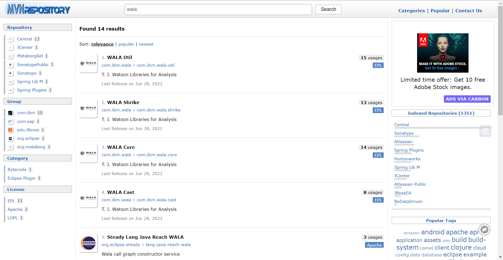
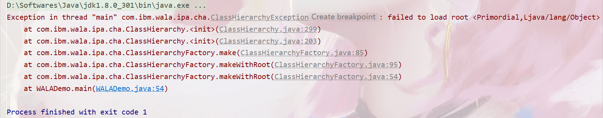
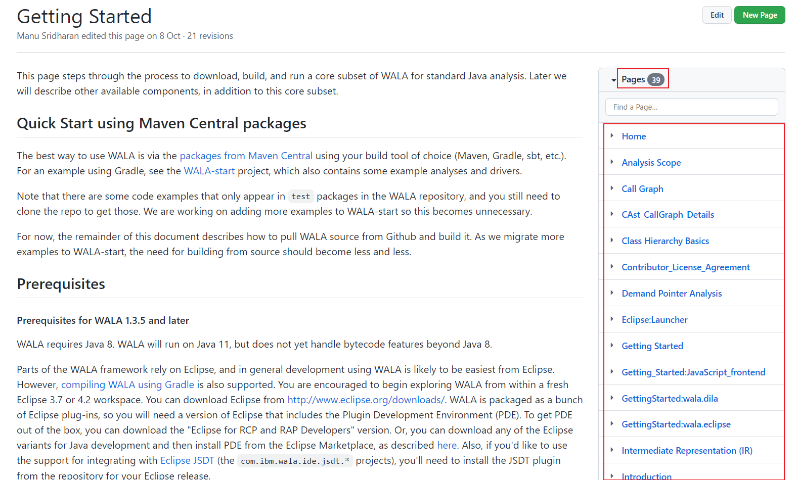

# WALA使用指南

## 写作目的

WALA作为一款Java源码分析工具给我们提供了许多强大的功能，如类的层次分析、生成调用关系图、中间代码分析等等

然而网上关于WALA的学习资料非常少，所以我想通过这篇文章来总结一下WALA最基本的用法，并把我收集到的一些资料通过链接的方式分享给大家，一来算是对于自动化测试工具复现的一部分工作总结，二来也是希望学弟学妹们后续如果选择源码分析方向的工具复现可以参照这篇文章来学习WALA，也算是一种传承吧哈哈哈哈哈哈。


注意：以下所有的代码都是基于 **jdk8** 和 **wala1.5.7** 环境，且在**2021年11月30日**之前能够正常运行，考虑到之后wala更新可能带来的部分接口的改变，大家还是要依据最新的官方文档接口进行相关函数的调用。


## WALA导入

wala的导入和简单实用可以参考[这篇文章](https://blog.csdn.net/weixin_45642882/article/details/110891528?ops_request_misc=%257B%2522request%255Fid%2522%253A%2522163784367516780255211239%2522%252C%2522scm%2522%253A%252220140713.130102334..%2522%257D&request_id=163784367516780255211239&biz_id=0&utm_medium=distribute.pc_search_result.none-task-blog-2~blog~sobaiduend~default-2-110891528.pc_v2_rank_blog_default&utm_term=WALA%E5%85%A5%E9%97%A8&spm=1018.2226.3001.4450)，应该是我院某届的学长留下的文章哈哈哈哈，里面大部分内容都可以直接借鉴，有些小细节我会在下面强调。

可以通过 **maven的pom.xml文件配置** 以及 **手动下载并导入jar包** 这两种方式将wala的jar包导入到项目中。

我在工具复现的过程中采用的是手动导入的方式，pom.xml文件可以参考上面链接中的文章，没试过配置文件的正确性蛤，反正手动导入也不麻烦就是说。

手动导入具体来讲首先要从官网下载好相关的jar包	[maven仓库](https://mvnrepository.com/search?q=wala)

在上方的搜索框搜索wala点进具体页面选择想要下载的wala的版本（这里建议选择我后续使用的 **wala1.5.7**）

需要下载4个jar包：`WALA UTIL`、`WALA Shrike`、`WALA Core`和`WALA Cast`



下载完成之后进入IDEA项目之中选择 **File -> Project Structure -> Libraries** ，点击 **+** 号将下载好的jar包导入项目。


## WALA配置

需要配置三个文件`exclusions.txt`、`scope.txt`和`wala.properties`，这三个文件的含义和具体内容都可以参考上面的文章，都没有啥大问题滴~

注意点：

* `wala.properties`配置文件中的 **java_runtime_dir** 参数需要改为项目**当前项目使用的jdk文件夹目录**，注意是jdk的根目录而不是jdk目录下的bin目录，网上有些文章写的是bin目录导致我报错查了好久呜呜呜，最后是参考了[这个帖子](https://github.com/reddr/LibScout/issues/34)解决的。如果这个地方没有配置正确会出现下面这样的报错：




***

终于要开始讲解wala的使用啦，这一部分也是我花了最多功夫来学习的内容，而且还没怎么学会就是说（可恶）

Talk is cheap, show you the code. 咱们结合代码来具体讲解：

## 生成调用关系图

```Java
private static final String BASEDIR = "你的项目地址";
private static final String SCOPEPATH = BASEDIR + "src/main/resources/scope.txt";
private static final String EXCLUSIONSPATH = BASEDIR + "src/main/resources/exclusions.txt";
private static final String TARGETPATH = BASEDIR + "target/test-classes/Test.class";

private CallGraph createCallGraph(String targetClass) throws CallGraphBuilderCancelException, ClassHierarchyException, InvalidClassFileException, IOException {
    // 确定分析域和需要排除的Java内置类
    AnalysisScope scope = AnalysisScopeReader.readJavaScope(
        SCOPEPATH,
        new File(EXCLUSIONSPATH),
        ScopeFileCallGraph.class.getClassLoader()
    );
    // 将需要进行分析的class文件加到分析域中
    scope.addClassFileToScope(ClassLoaderReference.Application, new File(targetClass));
    // 生成类层次关系
    ClassHierarchy hierarchy = ClassHierarchyFactory.makeWithRoot(scope);
    // 构建调用关系图
    AllApplicationEntrypoints entrypoints = new AllApplicationEntrypoints(scope, hierarchy);
    AnalysisOptions options = new AnalysisOptions(scope, entrypoints);
    SSAPropagationCallGraphBuilder builder = Util.makeZeroOneContainerCFABuilder(options, new AnalysisCacheImpl(), hierarchy, scope);
    CallGraph graph = builder.makeCallGraph(options, null);
    return graph;
}
```

1. 我们利用`AnalysisScopeReader`类的`readJavaScope`方法确定我们的分析域(即`scope.txt`中定义的内容)以及需要排除的Java内置类(即`exclusions.txt`文件中定义的内容)，整个Java项目可能依赖于大量的内置类，而其中的大部分对于我们后续的代码分析都是干扰，所以我们在这一步先将那些对于我们分析没有帮助的类排除出去。

   注意：这里的第三个参数要填写`ScopeFileCallGraph.class.getClassLoader()`，在[这篇文章](https://blog.csdn.net/weixin_45642882/article/details/110891528?ops_request_misc=%257B%2522request%255Fid%2522%253A%2522163784367516780255211239%2522%252C%2522scm%2522%253A%252220140713.130102334..%2522%257D&request_id=163784367516780255211239&biz_id=0&utm_medium=distribute.pc_search_result.none-task-blog-2~blog~sobaiduend~default-2-110891528.pc_v2_rank_blog_default&utm_term=WALA%E5%85%A5%E9%97%A8&spm=1018.2226.3001.4450)里面只说了这个参数是一个类加载器，没有具体说明是哪种类加载器，我也是参考了其他的文章才确认了这里要填的参数。

2. 我们利用`AnalysisScope`类的`addClassFileToScope()`方法将我们需要分析的类的 **class** 文件加入到分析域中。

3. 最后的几行代码用来生成类的层次关系和调用关系图，具体的方法含义我也没咋搞懂哈哈哈哈，反正照着抄就完事了。

   注意：参考[这篇文章](https://blog.csdn.net/xiyi5609/article/details/79092537?spm=1001.2014.3001.5501)，这里`Util.makeZeroOneContainerCFABuilder()`方法可以用`Util.makeNCFABuilder()`、`Util.makeZeroCFABuilder()`和`Util.makeZeroOneCFABuilder()`方法替代，不同的只是代码分析的粒度，我在使用的时候没感觉出来有啥太大的区别。


## 遍历调用关系图

```Java
public void ateDefUseMatrix(String targetClass) throws IOException, WalaException, IllegalArgumentException, InvalidClassFileException, com.ibm.wala.util.CancelException {
    // 以下为项目截取的部分代码
    CallGraph graph = createCallGraph(targetClass);
    for (CGNode node : graph) {
        // 自己定义的类的方法都是ShrikeBTMethod对象
        if (node.getMethod() instanceof ShrikeBTMethod) {
            ShrikeBTMethod method = (ShrikeBTMethod) node.getMethod();
            // 我们不关心使用Primordial类加载器加载的Java原生类
            if ("Application".equals(method.getDeclaringClass().getClassLoader().toString())) {
                // TODO
            }
        }
    }
}
```

在`CallGraph`中每个`CGNode`节点代表一个具体的方法，我们在遍历整个调用关系图的时候还要对所有的方法进行一遍过滤，还是同样的道理，我们只关心我们自己写的类中的方法，不关心Java内置类中提供的方法。

在wala中所有的自定义方法都属于`ShrikeBTMethod`对象，并且我们自己定义的类都会被`Application`类加载器加载(关于类加载器的知识可以自行查阅资料学习)，根据这两点我们就可以过滤掉大部分的无效方法节点。当然并不能过滤掉所有方法，例如`System.out.println()`方法就不会被过滤掉，不过我们依然们可以在后续的步骤中通过目标类的类名或者要进行分析的方法的方法名进一步过滤。


## 使用CGNode

我们接下来所有的分析都要基于`CGNode`类来进行，我们可以查阅[接口文档](http://wala.sourceforge.net/javadocs/trunk/)或者[界面更好看的接口文档](https://wala.github.io/javadoc/)来学习这个类提供给我们的各种方法。不过个人感觉这个文档写得相当于没写，就说明了一下方法的签名，连方法方法是干啥的都没有讲。这一部分也是学起来最困难的部分，因为几乎没有资料可以参考。

我学习的时候是借助IDEA的代码提示来看各个类提供了哪些方法，然后针对用法不明确的方法再去Google上搜索相关的用法。同时可以借助代码中的断点来查看某些对象的具体内容，进而推测出对应类的作用。

这样学习虽然听上去效率不高不过已经算是最有效的方法了，毕竟没有官方文档的情况下各种类和方法的使用基本只能靠猜测哈哈哈哈哈。


## 学习♂资料

虽说wala相关的资料非常少，但我在学习的过程中还是发现了一些不错的文章/总结，在这里分享给大家。

* [WALA Github仓库](https://github.com/wala/WALA)

* [WALA 官方使用指南](https://github.com/wala/WALA/wiki/Getting-Started)，在这个页面的右边找到 **pages** 下拉框就能看到相关内容啦~



* [WALA 维基百科](http://wala.sourceforge.net/wiki/index.php/Main_Page)，这个维基百科的内容和上面的官方指南除了排版其他一模一样。

* [WALA 论坛](https://groups.google.com/g/wala-sourceforge-net/)，里面记录了许多大家在使用wala过程中普遍出现的问题以及解决方法，有相关的wala问题也可以到上面去提问。

* [WALA Tutorial](https://docs.google.com/viewer?url=http%3A%2F%2Fwala.sourceforge.net%2Ffiles%2FPLDI_WALA_Tutorial.pdf)，wala指导，个人感觉用处不大，里面只有些代码片段，在没有完全理解wala使用的情况下甚至跑不起来里面的代码哈哈哈哈。

* [WALA-start](https://github.com/wala/WALA-start)，基于wala进行代码分析的一个Demo，然而我clone下来没有跑起来就是说，不知道是不是代码有问题。

  PS：我后来看到上面提到的那个论坛有人也提出了这个问题，可以参考一下里面的解决方案。

* [WALA-imporve](https://github.com/Leo0426/WALA-improve)，也是个wala的Demo，并且介绍了wala相关各种概念。项目我没有clone下来运行不清楚能不能运行，不过概念介绍确实是讲得挺清晰的。

* [WALA安装和简单使用](https://blog.csdn.net/xiyi5609/article/details/78779574?ops_request_misc=%257B%2522request%255Fid%2522%253A%2522163788940216780265488274%2522%252C%2522scm%2522%253A%252220140713.130102334..%2522%257D&request_id=163788940216780265488274&biz_id=0&utm_medium=distribute.pc_search_result.none-task-blog-2~blog~sobaiduend~default-1-78779574.pc_v2_rank_blog_default&utm_term=WALA%E5%85%A5%E9%97%A8&spm=1018.2226.3001.4450)、[WALA---Java程序静态切片技术](https://blog.csdn.net/xiyi5609/article/details/78949138)和[WALA---Java程序静态切片技术（二）](https://blog.csdn.net/xiyi5609/article/details/79092537?ops_request_misc=&request_id=&biz_id=102&utm_term=WALA%E5%85%A5%E9%97%A8&utm_medium=distribute.pc_search_result.none-task-blog-2~blog~sobaiduweb~default-3-79092537.pc_v2_rank_blog_default&spm=1018.2226.3001.4450)，这三篇博客是一个系列，简单介绍了wala从安装到进行静态切片分析的整个过程，算是wala相关的中文博客里面质量较高的了。

* [WALA之源代码生成调用关系图](https://blog.csdn.net/xiexie1357/article/details/88726572)，介绍了使用wala调用关系图的流程。

* [WALA 代码实例](https://www.baidu.com/s?ie=utf-8&f=8&rsv_bp=1&ch=&tn=88093251_92_hao_pg&bar=&wd=%E7%B1%BB%E4%BB%A3%E7%A0%81%E7%A4%BA%E4%BE%8B+%E6%9C%AC%E6%96%87%E6%95%B4%E7%90%86%E6%B1%87%E6%80%BB%E4%BA%86Java%E4%B8%ADcom.ibm.wala&oq=%25E7%25B1%25BB%25E4%25BB%25A3%25E7%25A0%2581%25E7%25A4%25BA%25E4%25BE%258B%2520%25E6%259C%25AC%25E6%2596%2587%25E6%2595%25B4%25E7%2590%2586%25E6%25B1%2587%25E6%2580%25BB%25E4%25BA%2586Java%25E4%25B8%25ADcom.ibm.wala.&rsv_pq=aa1804db002ff193&rsv_t=e1a4QKaYiFMCjsqFB4yk0HcMrV07YrEDeUDDAfmJ9eJNjM9DEvhTvRSRsNO7ijVCLJKO1nxkCdzb&rqlang=cn&rsv_enter=1&rsv_btype=t&rsv_dl=tb&inputT=263)，最后这个是我在查资料的过程中发现的一个叫纯净天空的宝藏网站，里面记录了Java各种类的代码示例，虽然没有注释，不过能通过代码片段加深对于方法的理解。唯一不足的就是这个网站自己的搜索功能比较拉跨，所以需要借助搜索引擎的搜索功能，在百度或者Google输入关键字`类代码示例 本文整理汇总了Java中com.ibm.wala`获取wala相关类的代码示例。


最后的最后，希望人美心善的助教多~~少~~给点分吧！孩子真的学的要秃了（泪目），呜呜呜！

